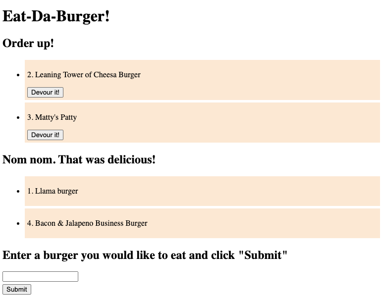

# burger
  

## Description
Node.js express server application used to log uneaten and eaten burgers. Utilizes handlebars and MySQL in MVC format.

## Table of Contents
- [Preview](#preview)
- [Installation](#installation)
- [Usage](#usage)
- [License](#license)
- [Contributing](#contributing)
- [Tests](#tests)
- [Questions](#questions)

## Preview  
[Go to application](https://ls-eat-da-burger.herokuapp.com/)  

## Installation
Use the package manager npm to install burger  
<pre><code>npm install burger</code></pre>

## Usage
User will need to npm install required dependencies found in package.json file.

## License  
Click on the badge (top of page) for this project's MIT licensing information.

## Contributing
Pull requests and stars are always welcome. For bugs and feature requests, [please submit an issue](https://github.com/ShepLT1/burger/issues/new)

## Tests  
To run tests, run the following command:
<pre><code>npm run test</pre></code>

## Questions
Please contact me with questions via email or Github  
 
lshepherd234@gmail.com  
[Github Profile](https://github.com/ShepLT1)